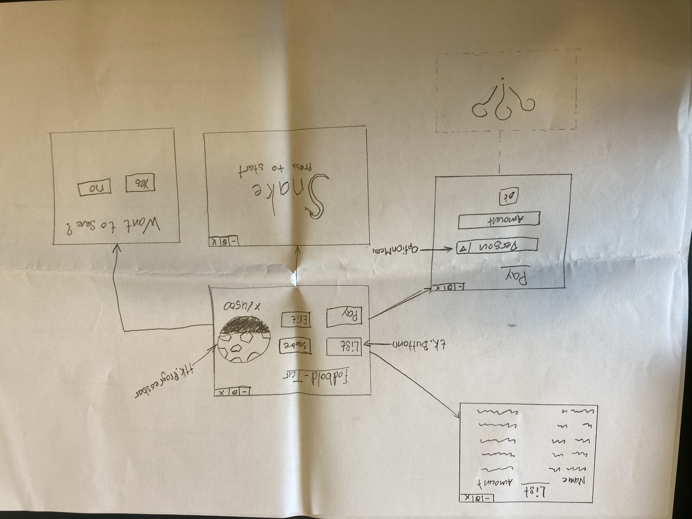
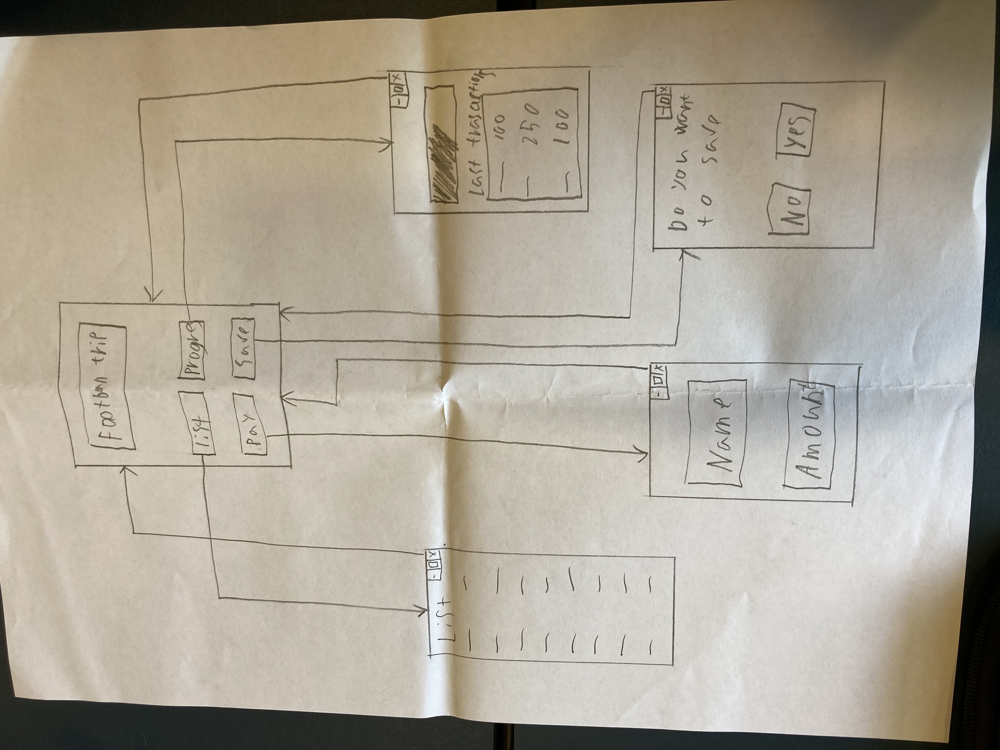
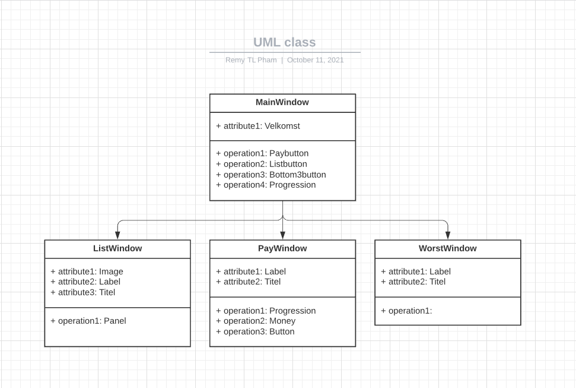
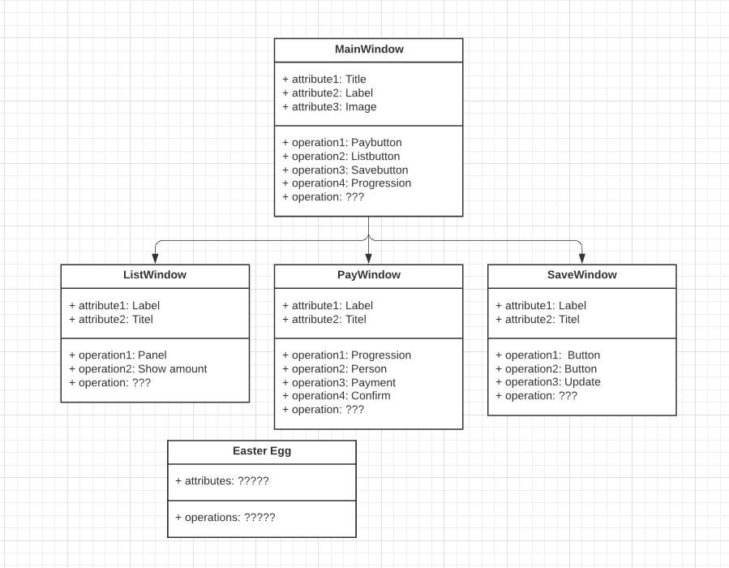
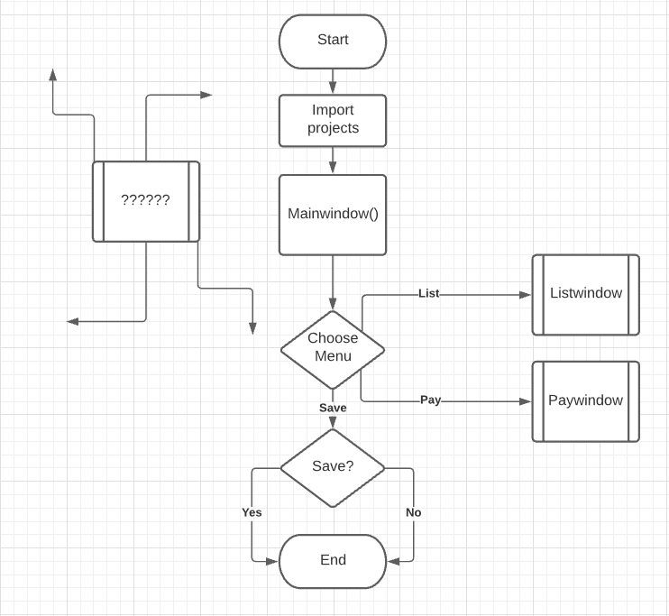
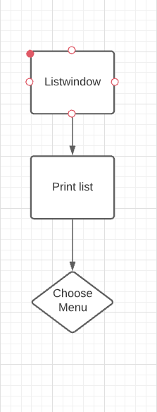
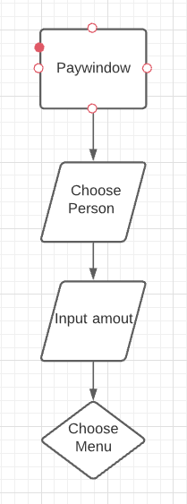
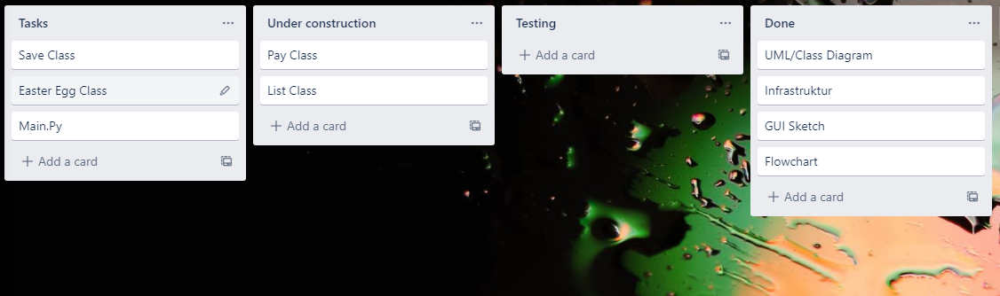

Hello my friend [Ny flowchart](http://youtube.com/watch?v=dQw4w9WgXcQ)

Her er en skitse/tegning af en GUI ide.

Her er en anden skitse/tegning af en GUI ide.

Her er vores UML analyse af Marks kodning.

Dette er et UML diagram der repræsentere hvordan vores GUI kommer til at se ud. Det er en vidre udvikling fra Marks kode af fodboldGUI.

Her er et flowchart over hvordan vi tænker vores GUI skal være.

Sådan skal pay funktionen se ud. Flowchartet skal ses som vis man brugte funktionen en enkelt gang, men det skal dog siges at man kan lukke vinduet på hvilket som helst tidspunkt man har lyst ved at trykke på krydset. 

Her er vores Trello so man kan se hvor langt vi er noget.

